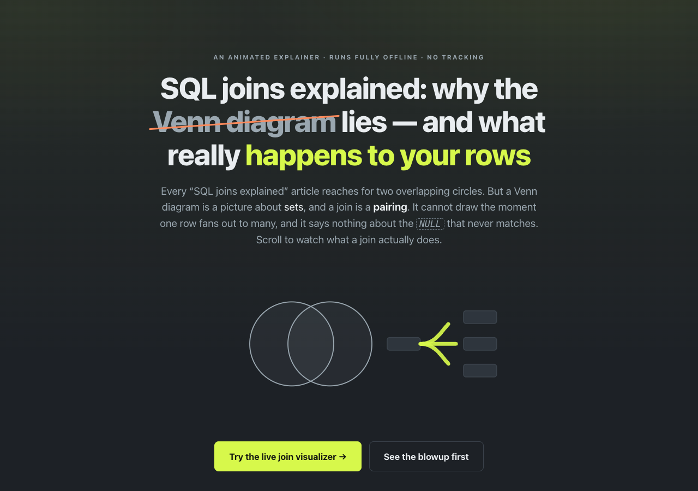

# joincraft-explained

**Why a Venn diagram lies about SQL joins — the row-by-row explainer.** A single animated page that explains what a SQL join *actually* does to your rows: the duplicate-key blowup where one row fans out to many, and the `NULL` that never matches — the two cases two overlapping circles can never draw. 100% client-side, zero dependencies, works fully offline. It links to a live, interactive visualizer where you can try it yourself.

## Why

Every "SQL joins explained" article reaches for a Venn diagram. But a Venn diagram is a picture about **sets**, and a join is a **pairing**. A membership diagram cannot show the moment a duplicated key makes the output *larger than either table*, and it says nothing about `NULL` — the single biggest source of join surprises.

This page takes the opposite approach. It walks you, animated, through the two things the diagram hides:

- **The duplicate-key blowup** — two "A"s on the left and three on the right produce 2 × 3 = 6 output rows for that key alone, so the result has more rows than either input.
- **The `NULL` that never matches** — because `NULL = NULL` evaluates to `UNKNOWN` (not `TRUE`), an `ON` clause never pairs two NULL keys… yet `GROUP BY` collapses those same NULLs into one bucket.

Then it points you at the real tool — a hand-rolled evaluator that draws the pairing as ribbons — so you can stop reading about joins and watch them.

## The live tool

This explainer is the companion to **joincraft**, an interactive SQL-join visualizer:

**[Open the joincraft visualizer &rarr;](https://sreenivas-sadhu-prabhakara.github.io/joincraft/)**

There you can edit two small tables, pick a join (INNER / LEFT / RIGHT / FULL / CROSS), and watch a genuine evaluator draw a ribbon from every output row back to the source rows it came from — solid for a matched pair, dashed into a NULL pad for an orphan — with a row-math strip, a three-valued-logic NULL corner, a GROUP BY stage, and 12 one-click gotcha scenarios.

## What's on the page

- **An animated narrative** — a discredited Venn diagram morphs into an honest ribbon fan; the blowup demo draws six ribbons from a five-row input; packets fly at a wall to show the enforced-privacy guarantee.
- **The real problem** — the exception cases that actually bite: mysterious extra rows, a missing customer, an inflated `SUM`, and the `NULL` paradox.
- **The blowup**, **the NULL that never matches**, **GROUP BY doing the opposite**, and **the privacy guarantee** — each with a small inline-SVG or CSS figure.
- **A short feature tour** of the visualizer, and a prominent call to action to open it.

## Quickstart

Just open `index.html` in any modern browser — no build step, no server, no install.

- **Local:** double-click `index.html`, or run a static server in the folder.
- **Hosted:** **[Open the explainer live](https://sreenivas-sadhu-prabhakara.github.io/joincraft-explained/)**

## Privacy

- A strict Content-Security-Policy sets `connect-src 'none'`: the page **cannot** make any network request even if it tried.
- No external fonts, scripts, images, or analytics. Everything is self-contained.
- All motion is optional and respects `prefers-reduced-motion` — with reduced motion on, every figure degrades to a legible static state.
- Because there are no network dependencies, it works with **no signal at all** — load it once and it keeps working offline.

## Accessibility

- WCAG-AA contrast in **both** light and dark schemes; state is never encoded by color alone (dashed patterns and text labels carry the NULL/orphan meaning).
- Keyboard-operable with a visible focus ring and a skip-link; system-ui sans throughout (no serif display fonts).
- Animations are purely decorative and are disabled under `prefers-reduced-motion`.

## Disclaimer

joincraft-explained is an educational page that illustrates SQL join and NULL semantics for learning. The linked visualizer is a teaching model, not a database engine, and neither is a substitute for testing against your real database or for authoritative documentation. ANSI three-valued-logic behaviour was cross-checked against SQLite, but real databases can differ in collation, type coercion, and dialect extensions — verify anything important on your actual database. This software is provided under the MIT License, "as is", without warranty of any kind; the author accepts no liability for any loss or damage arising from its use.

## License

[MIT](./LICENSE) © 2026 Sreenivas Sadhu Prabhakara
